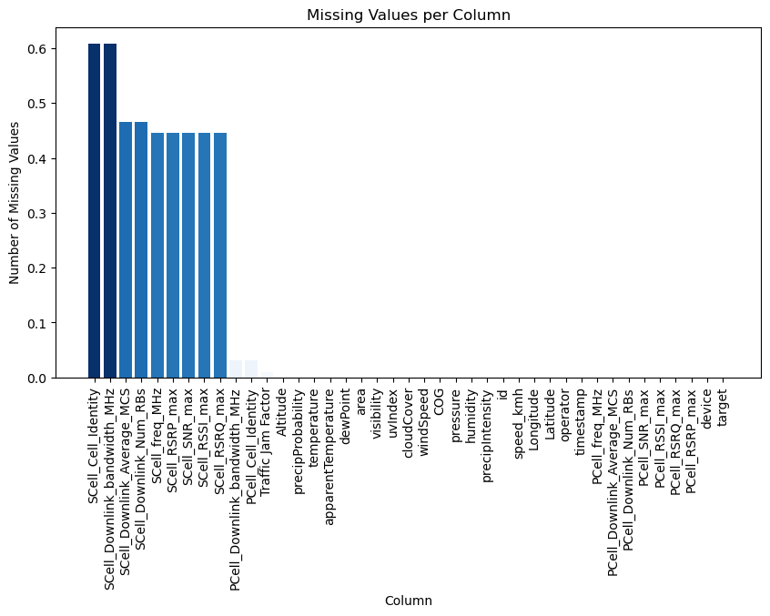
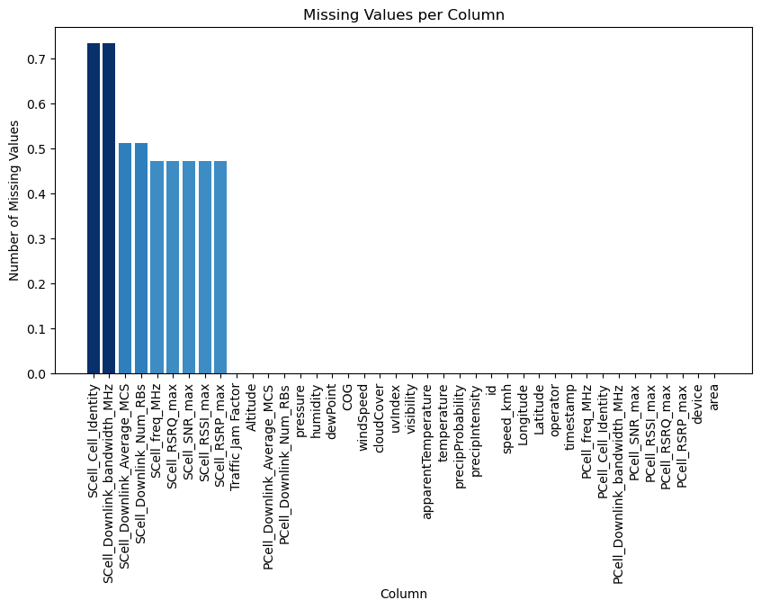
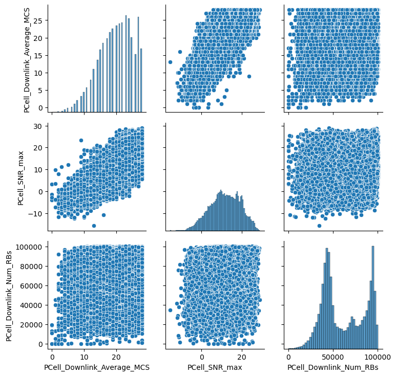
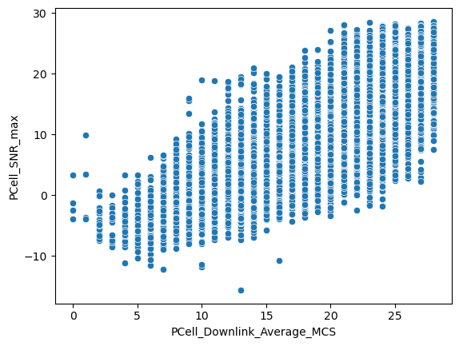
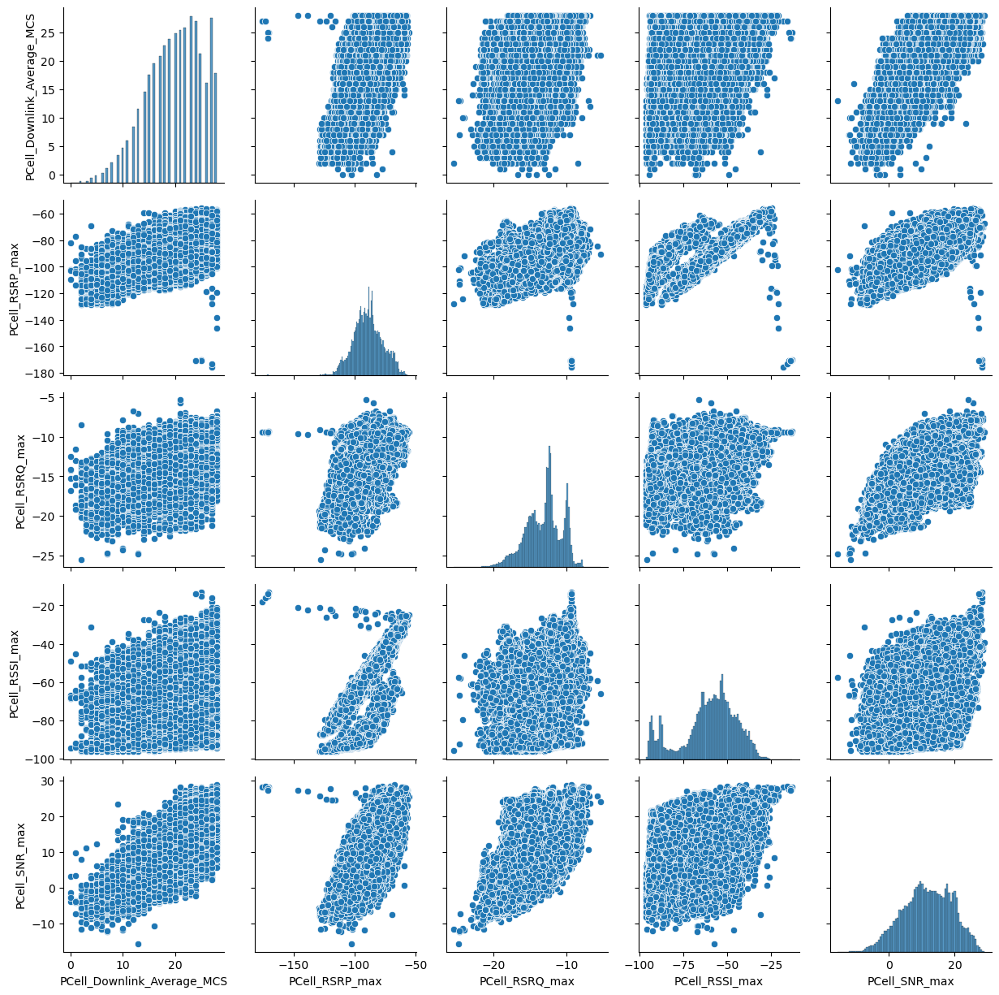
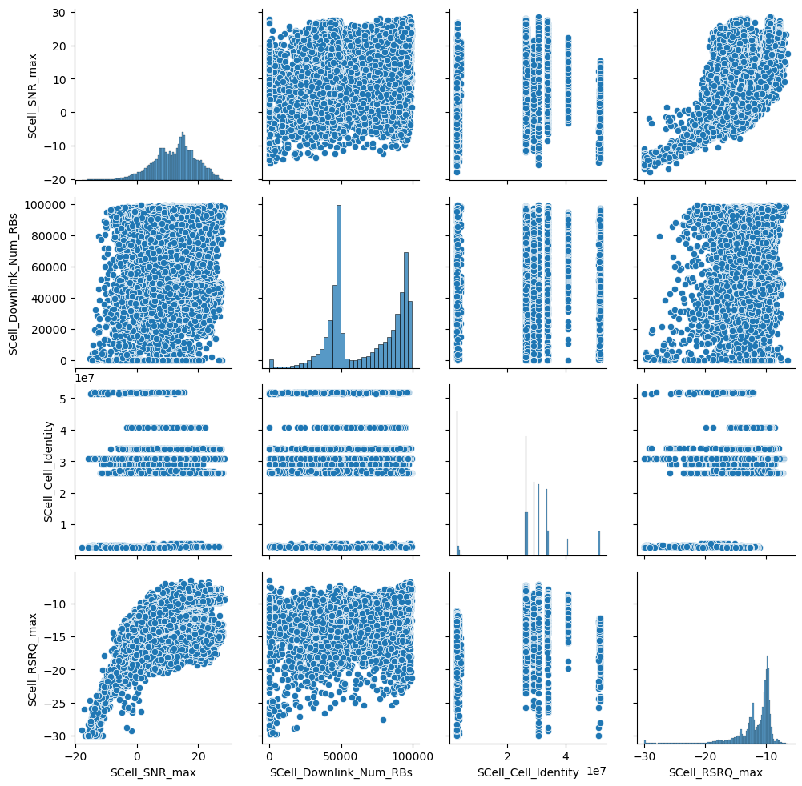
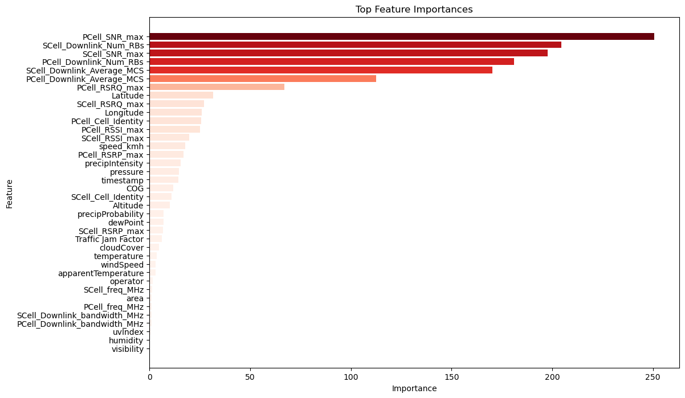

# Predicting Wireless Quality of Service in Multi-Domain Environments

## Project Overview
This project focuses on predicting wireless Quality of Service (QoS) metrics such as latency, throughput, and reliability in multi-domain environments. Using the Berlin V2X dataset and CatBoost (CBC), the analysis explores how network parameters influence QoS and how predictive models can optimize it.

## Objectives
- To preprocess and analyze the Berlin V2X dataset.
- To implement and evaluate the CatBoost Regressor for predicting QoS.
- To derive insights into the importance of features affecting QoS.
- To visualize results for better interpretability.

---

## Workflow

### 1. Data Preprocessing

#### Steps:
- **Loading the Dataset**: The Berlin V2X dataset was loaded and inspected for initial understanding.
- **Handling Missing Values**:
  - Missing values were imputed using the `SimpleImputer` with mean and median strategies.
  - Categorical columns were encoded using the `OrdinalEncoder`.
- **Scaling Features**: Numerical features were scaled using `StandardScaler` and `MinMaxScaler` to normalize the data for better model performance.

#### Visualization:
- **missing values for training set**:
  

- **missing values for testing set**:
  

---

### 2. Exploratory Data Analysis (EDA)

#### Steps:
- **Correlation Analysis**: Examined relationships between features and target variables using correlation heatmaps.
- **Feature Importance**: Identified significant features influencing QoS metrics.

#### Visualizations:
- **Correlation Heatmaps**:
- 
- 
- 
- 
  

---

### 3. Model Training and Evaluation

#### Steps:
- **Model Selection**:
  - Implemented CatBoost Regressor as the primary model for prediction.
  - Used `K-Fold Cross-Validation` to evaluate model performance.

- **Performance Metrics**:
  - Root Mean Squared Error (RMSE)
  - Mean Absolute Error (MAE)

#### Results:
## Performance Table

### TT Dataset Performance

| **Fold** | **Dataset** | **Best RMSE**       | **Best Iteration** |
|----------|-------------|---------------------|---------------------|
| Fold 1   | TT          | 9,352,584.717       | 927                 |
| Fold 2   | TT          | 8,900,936.225       | 1,057               |
| Fold 3   | TT          | 9,062,812.230       | 959                 |
| Fold 4   | TT          | 8,943,788.723       | 1,071               |
| Fold 5   | TT          | 8,741,932.182       | 765                 |
| **Average RMSE** | **TT** | **9,000,410.815**   | **-**               |

### TT_1 Dataset Performance

| **Fold** | **Dataset** | **Best RMSE**       | **Best Iteration** |
|----------|-------------|---------------------|---------------------|
| Fold 1   | TT_1        | 8,917,765.610       | 705                 |
| Fold 2   | TT_1        | 9,366,466.339       | 623                 |
| Fold 3   | TT_1        | 8,988,736.834       | 1,152               |
| Fold 4   | TT_1        | 9,235,183.579       | 823                 |
| Fold 5   | TT_1        | 8,814,851.163       | 1,113               |
| **Average RMSE** | **TT_1** | **9,064,600.705** | **-**               |

## Explanation of Merging Predictions with Targets for Analysis

The predictions were merged with actual target values from various datasets to create ensemble predictions for model analysis.

### Process Overview

The methodology involves:
- **Merging Predictions with Targets**: Combining the model predictions with corresponding target values from multiple datasets to build a complete dataset for evaluation.
- **Evaluating the Baseline Model**: Running the baseline model on different datasets to predict target values and assess model performance.
- **Generating Ensemble Predictions**: Averaging the predictions from all datasets to create a final ensemble prediction.

### Step-by-Step Explanation

#### 1. Merging Predictions with Target Values
Predictions from the baseline model were generated for each dataset (e.g., TT, TT_1, and TT_2). These predictions were merged with the actual target values from the respective datasets to create comprehensive data tables. This merging facilitates a direct comparison between the predicted values and the actual targets, aiding in evaluation and further analysis.

#### 2. Evaluating the Baseline Model
The baseline model was applied to each dataset using KFold cross-validation to split the data into training and test sets. This method helps in evaluating the model's performance across different data partitions, ensuring a robust estimation of its predictive power.

#### 3. Creating Ensemble Predictions
Predictions from each dataset were combined to form an ensemble prediction. This was done by averaging the predictions across all datasets, which helps to mitigate variability and enhance the overall prediction stability.

#### 4. Generating a Final Output
The ensemble predictions were compiled into a final DataFrame that included an `id` column for identification and a `target` column for the predicted values. This dataset was then exported as a CSV file for further analysis, review, or submission.

### Baseline Model Performance Analysis
The baseline model's performance was measured for each dataset by calculating evaluation metrics such as the cross-validated Root Mean Squared Error (CV-RMSE). These scores provide insight into the model's accuracy and how well it generalizes across different data splits.

---

### 4. Visualization of Predictions

#### Steps:
- Visualized predicted vs actual QoS metrics to evaluate model performance.
- Used scatter plots and residual analysis for detailed assessment.

#### Results:
- **Feature Importance**:
  

---

## Key Insights
- Feature engineering and preprocessing significantly influence model performance.
- CatBoost provides reliable and accurate predictions for QoS metrics.
- Visualization aids in understanding model behavior and performance metrics.

---

## Conclusion
This project demonstrates the effectiveness of CatBoost Regressor in predicting QoS metrics in multi-domain environments. By leveraging the Berlin V2X dataset, significant insights were derived into the factors affecting wireless QoS, paving the way for enhanced network optimization strategies.

---

## Future Work
- Integrate it with other emerging technologies, such as edge computing, cloud platforms, and advanced vehicular systems/IOT. This integration can help optimize real-time decision-making and support smart city initiatives. Additionally, we can explore extending the solution to include predictive analytics for uplink throughput and other network parameters, paving the way for more comprehensive QoS management frameworks in multi-domain environments.

---

## Acknowledgements
Special thanks to Bhupendra kumar sir and the creators of the Berlin V2X dataset and the open-source community , kaggle for providing tools , resources  and frameworks that made this analysis possible.

---
