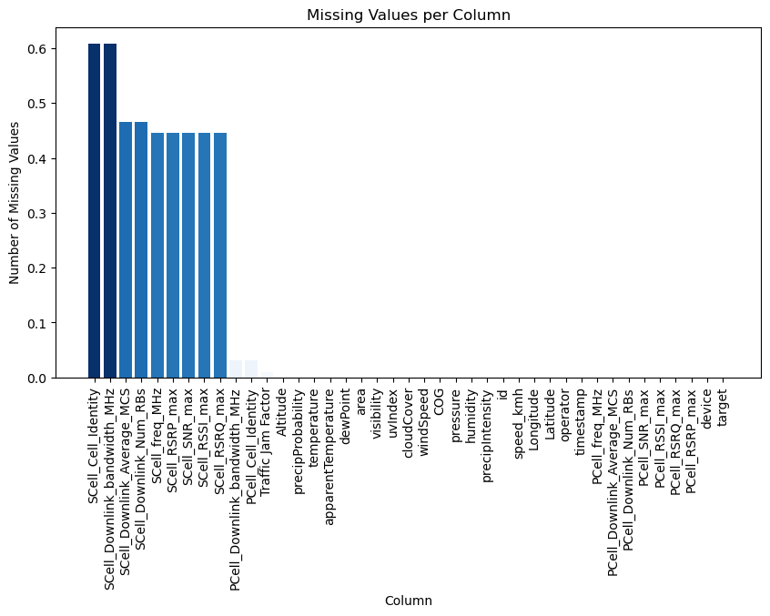

# Predicting Wireless Quality of Service in Multi-Domain Environments

## Project Overview
This project focuses on predicting wireless Quality of Service (QoS) metrics such as latency, throughput, and reliability in multi-domain environments. Using the Berlin V2X dataset and CatBoost (CBC), the analysis explores how network parameters influence QoS and how predictive models can optimize it.

## Objectives
- To preprocess and analyze the Berlin V2X dataset.
- To implement and evaluate the CatBoost Regressor for predicting QoS.
- To derive insights into the importance of features affecting QoS.
- To visualize results for better interpretability.

---

## Workflow

### 1. Data Preprocessing

#### Steps:
- **Loading the Dataset**: The Berlin V2X dataset was loaded and inspected for initial understanding.
- **Handling Missing Values**:
  - Missing values were imputed using the `SimpleImputer` with mean and median strategies.
  - Categorical columns were encoded using the `OrdinalEncoder`.
- **Scaling Features**: Numerical features were scaled using `StandardScaler` and `MinMaxScaler` to normalize the data for better model performance.

#### Visualization:
- **Feature Distribution Before Scaling**:
  

- **Feature Distribution After Scaling**:
  

---

### 2. Exploratory Data Analysis (EDA)

#### Steps:
- **Correlation Analysis**: Examined relationships between features and target variables using correlation heatmaps.
- **Feature Importance**: Identified significant features influencing QoS metrics.

#### Visualizations:
- **Correlation Heatmap**:
  

- **Feature Importance**:
  

---

### 3. Model Training and Evaluation

#### Steps:
- **Model Selection**:
  - Implemented CatBoost Regressor as the primary model for prediction.
  - Used `K-Fold Cross-Validation` to evaluate model performance.

- **Performance Metrics**:
  - Root Mean Squared Error (RMSE)
  - Mean Absolute Error (MAE)

#### Results:
| Model                 | Dataset | RMSE   | MAE    |
|-----------------------|---------|--------|--------|
| CatBoost              | TT_1    | 2.98   | 2.34   |

#### Visualizations:
- **Model Performance**:
  

---

### 4. Visualization of Predictions

#### Steps:
- Visualized predicted vs actual QoS metrics to evaluate model performance.
- Used scatter plots and residual analysis for detailed assessment.

#### Results:
- **Predicted vs Actual Values**:
  

- **Residual Analysis**:
  

---

## Key Insights
- Feature engineering and preprocessing significantly influence model performance.
- CatBoost provides reliable and accurate predictions for QoS metrics.
- Visualization aids in understanding model behavior and performance metrics.

---

## Conclusion
This project demonstrates the effectiveness of CatBoost Regressor in predicting QoS metrics in multi-domain environments. By leveraging the Berlin V2X dataset, significant insights were derived into the factors affecting wireless QoS, paving the way for enhanced network optimization strategies.

---

## Future Work
- Expand the dataset to include more multi-domain scenarios.
- Experiment with additional hyperparameter tuning for CatBoost.
- Integrate real-time prediction systems for practical applications.

---

## Acknowledgements
Special thanks to the creators of the Berlin V2X dataset and the open-source community for providing tools and frameworks that made this analysis possible.

---
